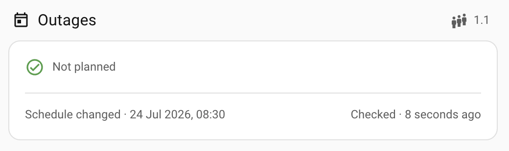
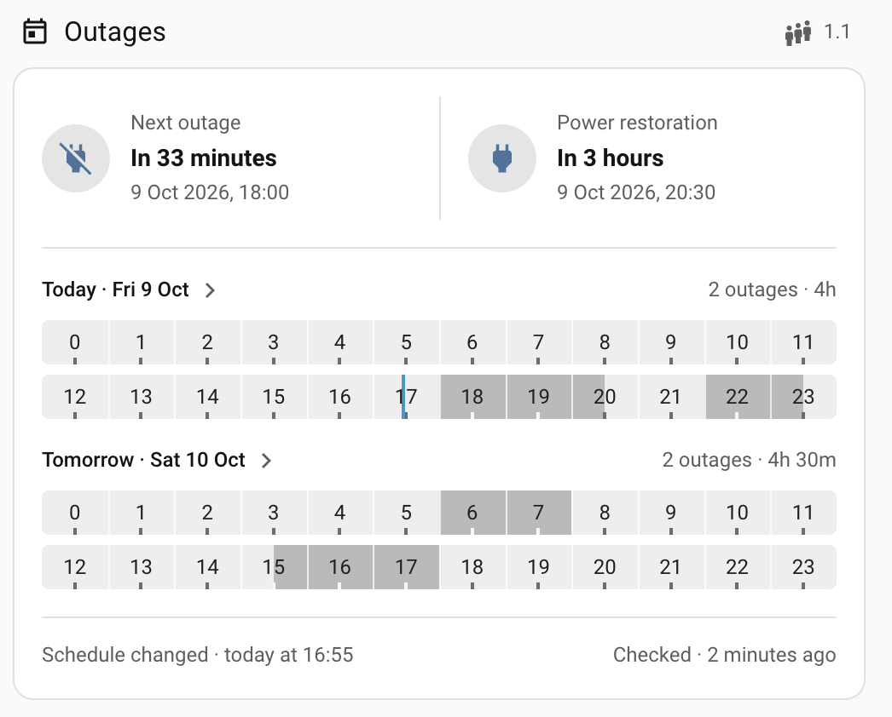
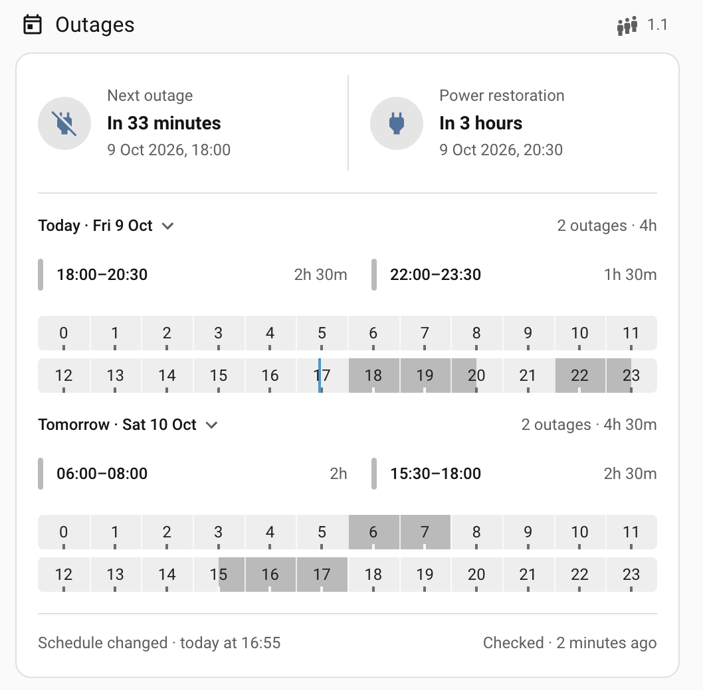
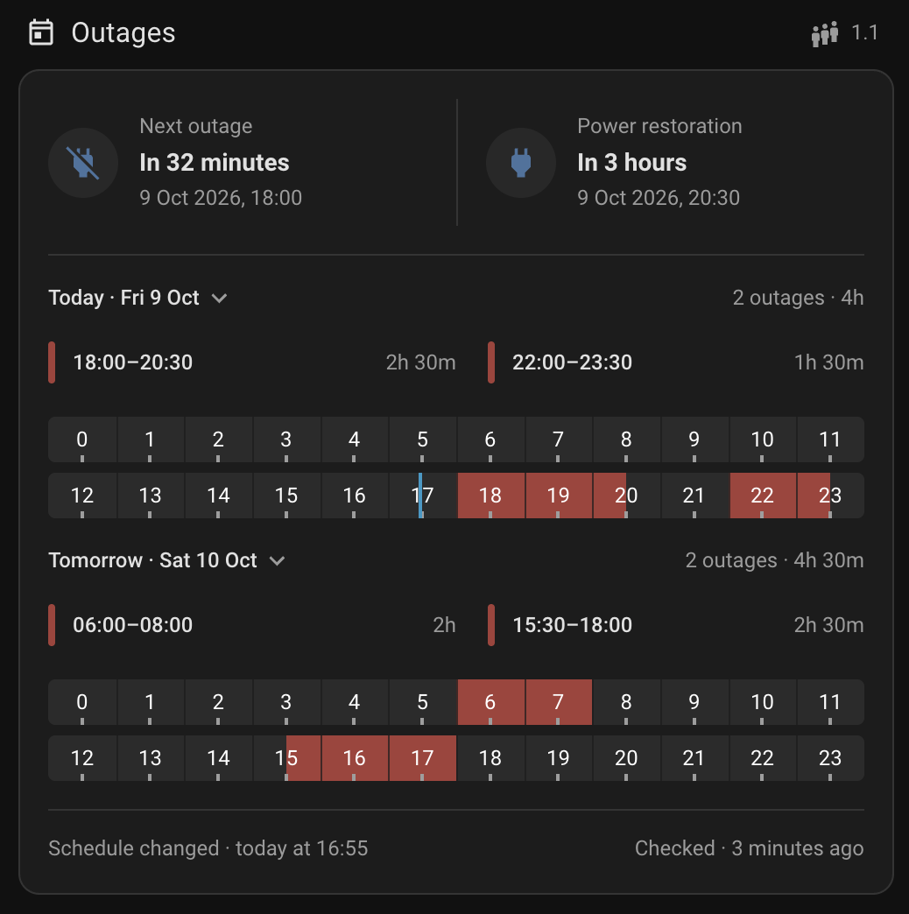
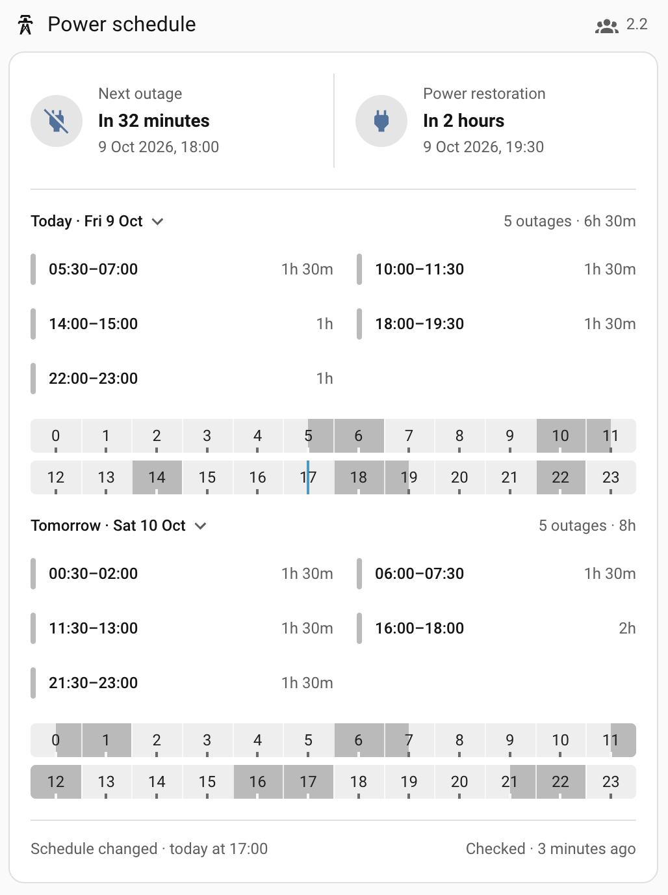
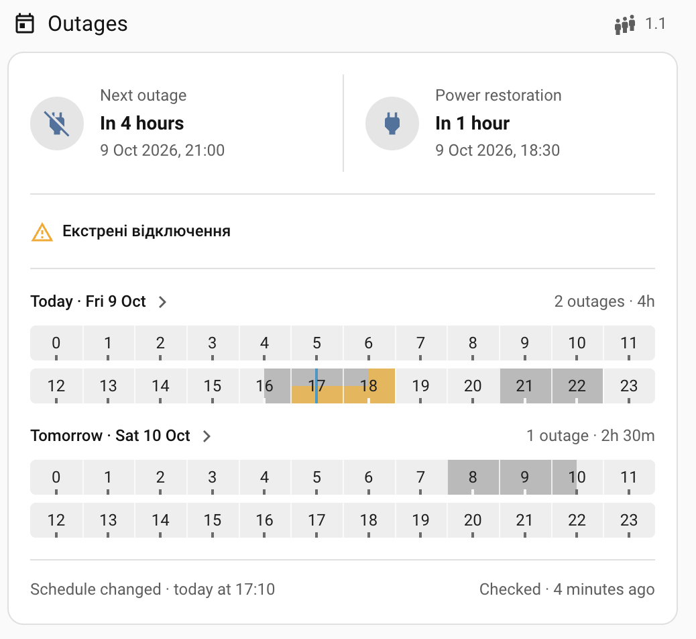

# e9y API

A small HTTP API for DTEK outage data and NERC household green tariffs. Run one
instance on a machine with Node.js and Chrome Headless Shell, then use it from
one or more Home Assistant installations. Every route requires HTTP Basic Auth.

## Why this exists

DTEK does not provide a public outage API. The
[ha-yasno-outages](https://github.com/denysdovhan/ha-yasno-outages) integration
is easier to install and may be a better fit for some setups, but its data comes
from the YASNO API and can arrive later than changes on the DTEK website. That
delay matters when an outage schedule changes during the day and Home Assistant
uses it for battery planning, load shifting, or notifications.

This service reads the DTEK website directly. It also reads the latest NERC
decree, so the same service can provide the correct green-tariff price for
installations commissioned on different dates.

## Features

- Gets the current DTEK schedule for addresses in the configured DTEK region.
- Returns DTEK data and schedule events as JSON, with an optional ICS feed for
  calendar clients.
- Reports the next outage, next power restoration, current outage reason, and
  the reason's start and end times.
- Returns a compact fingerprint that Home Assistant sends back on the next poll.
  The API compares it without storing per-address notification state or sending
  a false midnight alert.
- Finds the latest NERC green-tariff decree, reads all of its date ranges, and
  returns the price that applies to the requested commissioning date.
- Loads one browser page per DTEK region, keeps its cookies and regional
  schedule state, refreshes it periodically, and resolves later addresses
  through DTEK's AJAX endpoint.
- Caches DTEK data per address and the NERC tariff table once for all dates, so
  repeated requests do not open unnecessary browser sessions.
- Includes Home Assistant examples for REST sensors and notifications when a
  schedule or NERC decree changes.
- Includes a dependency-free Home Assistant outage card with localized labels,
  relative times, compact timelines, and configurable presentation.
- Keeps no outage history. When DTEK changes a schedule, the API and calendar
  show the new version.

## Configuration

Install the dependencies, then download the pinned Chrome Headless Shell build:

```sh
npm ci
npx @puppeteer/browsers install chrome-headless-shell@150.0.7871.46 --path "$HOME/.cache/e9y-api"
```

The install command prints the browser executable's absolute path. Copy
`.env.example` to `.env`, use that path for `PUPPETEER_EXECUTABLE_PATH`, set a
strong username and password, and adjust the optional DTEK cookie settings if
the selected regional site needs them.

```sh
cp .env.example .env
node --env-file=.env index.js
```

`puppeteer-core` and Chrome Headless Shell are pinned to matching versions that
run on macOS 12 Monterey. `npm install` and `npm ci` never download a browser;
the separate command above performs that explicit download.

The service listens on `0.0.0.0:8085` by default.

### Local browser debugging

Create a local `.env` and start the service with it:

```sh
cp .env.example .env
npm run start:local
```

To watch the DTEK page and see which stage is taking time, set:

```text
PUPPETEER_HEADLESS=false
DEBUG=true
BYPASS_CACHE=true
```

`PUPPETEER_HEADLESS=false` opens the configured full Chrome executable.
`DEBUG=true` disables HTTP Basic Auth and logs DTEK and NERC crawler stages,
completion times, and cache status. Use it only while binding the service to a
trusted interface such as `127.0.0.1`.
`BYPASS_CACHE=true` disables DTEK and NERC cache hits, in-flight request
sharing, and stale fallback; every request reaches its upstream source and
responds with `X-Cache: BYPASS`.

The persistent DTEK browser page and its cookies remain alive in bypass mode.
They are the upstream session, not a data cache: every DTEK request still makes
a live address AJAX request. This makes it possible to reproduce a bad address
without throwing away the working browser session between requests.

## Usage

### NERC green-tariff price

```text
GET /nerc/green-tariff-price?date=2025-09-01
```

`date` is the installation commissioning date in `YYYY-MM-DD` format. A
successful response contains the selected tariff and every range parsed from
the current decree. This shortened example shows two of those ranges:

```json
{
  "error": null,
  "tariff": 6.8001,
  "tariffs": [
    {
      "start_date": "2025-01-01",
      "end_date": "2025-12-31",
      "tariff": 6.8001
    },
    {
      "start_date": "2026-01-01",
      "end_date": "2029-12-31",
      "tariff": 6.134
    }
  ],
  "decree": {
    "id": "1613",
    "url": "https://www.nerc.gov.ua/acts/...",
    "published_at": "2026-09-30T16:03:57+03:00"
  }
}
```

The complete decree table is cached once, not once per requested date.

### DTEK shutdown state

Both DTEK endpoints take the same address query:

```text
GET /dtek/shutdowns.json?region=dnem&locality=Дніпро&street=шосе Запорізьке&building=80
GET /dtek/shutdowns.ics?region=dnem&locality=Дніпро&street=шосе Запорізьке&building=80
```

The JSON endpoint also accepts the opaque fingerprint returned by its previous
response:

```text
GET /dtek/shutdowns.json?...&previous_fingerprint=<FINGERPRINT>
```

URL-encode all query values when constructing the real URLs. The response
contains the replacement fingerprint, comparison results, and stable hashes for
the Kyiv calendar dates represented by `today` and `tomorrow`:

```json
{
  "fingerprint": "...",
  "schedule_changed": false,
  "tomorrow_became_available": false,
  "group": 1.1,
  "updated_at": "2026-10-07T09:00:00.000Z",
  "checked_at": "2026-10-07T12:03:00.000Z",
  "events": [
    {
      "start": "2026-10-07T12:00:00.000Z",
      "end": "2026-10-07T14:00:00.000Z"
    }
  ],
  "next_outage": "2026-10-07T12:00:00.000Z",
  "next_connectivity": "2026-10-07T14:00:00.000Z",
  "today": {
    "date": "2026-10-07",
    "hash": "...",
    "has_outages": true
  },
  "tomorrow": {
    "date": "2026-10-08",
    "hash": "...",
    "has_outages": false
  },
  "shutdown": {
    "updated_at": "2026-10-07T09:05:00.000Z",
    "started_at": "2026-10-07T09:00:00.000Z",
    "ends_at": "2026-10-07T11:00:00.000Z",
    "reason": "Екстрені відключення"
  }
}
```

`events` contains the ordered outage intervals used by dashboards and
automations. `next_outage`, `next_connectivity`, and `shutdown` are `null` when
no matching transition or current shutdown exists. `checked_at` is generated
for every JSON request and is not part of the cached schedule or fingerprint.
A missing, invalid, or
unsupported `previous_fingerprint` makes both comparison results `false`; the
new fingerprint returned by the same response repairs the next request. The ICS
response remains available as an optional read-only calendar feed.

### Home Assistant

The following is guidance to copy into each HA instance and customize. Replace
the address placeholders, commissioning date, entity suffixes, and
`notify.notify_all` for that instance. Home Assistant URL-encodes the `params`
values.

Add the credentials to `secrets.yaml`:

```yaml
e9y_api_username: your-user
e9y_api_password: your-password
```

Add the REST sensors to `configuration.yaml` or an included package. All
sensors under each resource are populated by one HTTP request:

```yaml
rest:
  ## Provide your address.
  ## <REGION>: dnem
  ## <CITY>: Дніпро
  ## <STREET>: шосе Запорізьке
  ## <BLD>: 80
  - resource: "https://grid-data.example.com/dtek/shutdowns.json"
    params:
      region: "<REGION>"
      locality: "<CITY>"
      street: "<STREET>"
      building: "<BLD>"
      previous_fingerprint: "{{ states('sensor.dtek_outage_schedule') }}"
    timeout: 160
    scan_interval: 180
    authentication: basic
    username: !secret e9y_api_username
    password: !secret e9y_api_password
    sensor:
      - name: DTEK Outage Schedule
        unique_id: dtek_outage_schedule
        value_template: "{{ value_json.fingerprint }}"
        json_attributes:
          - schedule_changed
          - tomorrow_became_available
          - group
          - events
          - updated_at
          - checked_at
          - next_outage
          - next_connectivity
          - today
          - tomorrow
          - shutdown

  ## Provide the Green Tariff commissioning date, e.g. `2025-09-01`.
  - resource: "https://grid-data.example.com/nerc/green-tariff-price?date=<DATE>"
    timeout: 160
    scan_interval: 86400
    authentication: basic
    username: !secret e9y_api_username
    password: !secret e9y_api_password
    sensor:
      - name: Electricity Export Rate
        unique_id: electricity_export_rate
        value_template: "{{ value_json.tariff }}"
        unit_of_measurement: "UAH/kWh"
        json_attributes:
          - decree
```

The DTEK schedule events, transition times, and current shutdown details are
attributes of the same entity for dashboard and automation use. Read them with
`state_attr('sensor.dtek_outage_schedule', 'events')`,
`state_attr('sensor.dtek_outage_schedule', 'next_outage')`,
`state_attr('sensor.dtek_outage_schedule', 'next_connectivity')`, and
`state_attr('sensor.dtek_outage_schedule', 'shutdown')`.

#### DTEK outage card

The dependency-free [`dtek-outage-card.js`](home-assistant/dtek-outage-card.js)
renders the sensor as one native-looking Home Assistant card. It includes the
next outage and restoration, special outage reason, expandable Today/Tomorrow
agendas, two 12-hour timeline rows per day, the DTEK schedule timestamp, and the
latest successful API check.

<details>
  <summary>🖼 <strong>Screenshots</strong></summary>

<h3>No outages</h3>



<h3>2-day schedule</h3>



<h3>2-day schedule (with opened agenda)</h3>



<h3>2-day schedule in dark mode (with opened agenda)</h3>



<h3>Dense schedule</h3>



<h3>Special outage status</h3>


</details>

Copy the JavaScript file to `/config/www/dtek-outage-card.js`, then register
`/local/dtek-outage-card.js` as a JavaScript module under **Settings →
Dashboards → Resources**. YAML-managed resources can register it directly:

```yaml
lovelace:
  resources:
    - url: /local/dtek-outage-card.js
      type: module
```

The smallest card configuration uses the default sensor:

```yaml
type: custom:dtek-outage-card
```

The sensor and requested heading/empty-state settings can be overridden:

```yaml
type: custom:dtek-outage-card
entity: sensor.dtek_outage_schedule
title: Outages
icon: mdi:calendar-today-outline
group_icon: mdi:human-queue
no_outages_text: Not planned
```

| Option | Default | Description |
| --- | --- | --- |
| `entity` | `sensor.dtek_outage_schedule` | REST sensor containing the DTEK response attributes. |
| `title` | Localized `Outages` | Heading text. |
| `icon` | `mdi:calendar-today-outline` | Heading icon. |
| `group_icon` | `mdi:human-queue` | Icon beside the group. Set it to an empty string to hide the icon. |
| `no_outages_text` | Localized `Not planned` | Text shown when no planned or special outage exists. |
| `testing_config` | — | Development-only sensor attributes for previewing the card without live data. |

English and Ukrainian labels are built in. For a manual preview, provide the
same attributes that normally come from the REST sensor:

```yaml
type: custom:dtek-outage-card
testing_config:
  group: "1.1"
  updated_at: "2026-10-09T16:00:00+03:00"
  checked_at: "2026-10-09T16:03:00+03:00"
  events:
    - start: "2026-10-09T18:00:00+03:00"
      end: "2026-10-09T20:30:00+03:00"
    - start: "2026-10-10T06:00:00+03:00"
      end: "2026-10-10T08:00:00+03:00"
  shutdown:
    reason: Екстрені відключення
    updated_at: "2026-10-09T15:55:00+03:00"
    started_at: "2026-10-09T16:00:00+03:00"
    ends_at: "2026-10-09T17:00:00+03:00"
```

#### DTEK schedule notifications

The REST request sends the sensor's current fingerprint back to the API. Home
Assistant only stores that opaque value; the API decodes it and returns the two
notification flags. No helper entity is needed. When both flags are true, the
more specific tomorrow-available message takes priority. The shared
`notification` variable keeps the delivery actions reusable.

```yaml
mode: queued
alias: e9y API - DTEK schedule notifications
triggers:
  - platform: state
    entity_id: sensor.dtek_outage_schedule
conditions:
  - condition: template
    value_template: "{{ trigger.to_state is not none and has_value(trigger.entity_id) }}"
actions:
  - choose:
      - conditions:
          - condition: template
            value_template: "{{ trigger.to_state.attributes.get('schedule_changed') }}"
        sequence:
          - variables:
              notification:
                message: 🔌 The outage schedule has changed!
      - conditions:
          - condition: template
            value_template: "{{ trigger.to_state.attributes.get('tomorrow_became_available') }}"
        sequence:
          - variables:
              notification:
                message: 🔌 Morrow's outage schedule dropped!
  - alias: Notify
    if:
      - condition: template
        value_template: "{{ notification is defined }}"
    then:
      - action: notify.notify_all
        data:
          message: "{{ notification.message }}"
      - action: telegram_bot.send_message
        data:
          message: |-
            {{ notification.message }}

            Check it out in the @NestWatchdogBot
          parse_mode: plain_text
          config_entry_id: 01KE01C6X423DYR165PHVBD5VB
          entity_id:
            - notify.watchdog_nestwatchdog_1002710792988
```

Add the NERC automation. It watches the `decree` attribute, so a tariff that
happens to remain unchanged does not hide a new decree. `has_value` rejects a
missing, `unknown`, or `unavailable` current sensor value; an initial update
without a previous decree attribute is ignored.

```yaml
mode: queued
alias: e9y API - NERC decree notifications
trigger:
  - platform: state
    entity_id: sensor.electricity_export_rate
condition:
  - condition: template
    value_template: >-
      {{ trigger.from_state is not none
         and trigger.to_state is not none
         and has_value(trigger.entity_id)
         and trigger.from_state.attributes.decree.id != trigger.to_state.attributes.decree.id }}
action:
  - variables:
      decree: "{{ trigger.to_state.attributes.decree }}"
  - action: notify.notify_all # Replace per HA instance.
    data:
      title: ⚡️ Export price changed!
      message: >-
        Decree {{ decree.id }}, tariff {{ trigger.to_state.state }} UAH/kWh.
        {{ decree.url }}
```

Home Assistant does not need a Remote Calendar entity: the REST sensor already
contains the schedule in its `events` attribute. The authenticated `.ics`
endpoint is still available for external calendar clients.

## Telegram Bot

Ignore this automation if you don't want/have a Telegram Bot.

```yaml
alias: Telegram Bot
mode: single
triggers:
  - trigger: state
    attribute: command
    entity_id:
      ## Replace with `event.YOUR_BOT_update_event`.
      - event.watchdog_update_event
conditions: []
actions:
  - variables:
      datetime_format: '%b %d, %Y at %H:%M'
  - alias: Commands
    choose:
      - alias: /start
        conditions:
          - alias: check
            condition: template
            value_template: >-
              {{ trigger.to_state.attributes.command == '/start' }}
        sequence:
          - variables:
              output: Oi!
      - alias: /help
        conditions:
          - alias: check
            condition: template
            value_template: >-
              {{ trigger.to_state.attributes.command == '/help' }}
        sequence:
          - variables:
              ## Replace `<YOUR_STREET>` and `<YOUR_CT>`.
              output: >-
                • Outdoor temperature and humidity are measured by an external
                sensor installed under the roof and shielded from direct
                sunlight and wind by surrounding walls.

                • The grid on/off schedule is retrieved from DTEK and updated
                every 3 minutes.

                • The grid on/off notifications are 100% accurate at mine's,
                though at your address the relevancy may drop due to several
                reasons.

                • The grid is monitored on the <YOUR_STREET> street and is accurate
                for connections to <YOUR_CT>.

                • You may occasionally receive multiple grid on/off
                notifications within a short period, even though power remains
                available at your location. This can happen for several reasons:
                  • Grid frequency temporarily falls outside the 49–51 Hz range; reconnection occurs automatically once the frequency stabilizes.
                  • The circuit breaker on my AVR trips; in this case, reconnection requires manual intervention.
                • The outage reason may be inaccurate or outdated. DTEK isn't
                really focused at maintaining it.
      - alias: /temp
        conditions:
          - alias: check
            condition: template
            value_template: >-
              {{ trigger.to_state.attributes.command == '/temp' }}
        sequence:
          - variables:
              output: >-
                {{ states('sensor.indoor_outdoor_meter_043e_temperature', false, true) }} sheltered ambient
                {{ states('sensor.samsung_ehs_outdoor_temperature', false, true) }} outdoor ambient
                {{ states('sensor.aerostar_ecostar_500_ec_x_outdoor_temperature', false, true) }} air
      - alias: /humi
        conditions:
          - alias: check
            condition: template
            value_template: >-
              {{ trigger.to_state.attributes.command == '/humi' }}
        sequence:
          - variables:
              output: >-
                {{ states('sensor.indoor_outdoor_meter_043e_humidity') }}%
      - alias: /next_[outage|connectivity]
        conditions:
          - alias: check
            condition: template
            value_template: >-
              {{ trigger.to_state.attributes.command in ['/next_outage', '/next_connectivity'] }}
        sequence:
          - variables:
              output: >-
                
                
                  {{ as_local(as_datetime(value)).strftime(datetime_format) }}
                
                  Unknown
                
                {{ '\n\n🕒 Refreshed at ' ~ as_local(as_datetime(states.sensor.dtek_outage_schedule.last_reported)).strftime(datetime_format) }}
      - alias: /outage_reason
        conditions:
          - alias: check
            condition: template
            value_template: >-
              {{ trigger.to_state.attributes.command == '/outage_reason' }}
        sequence:
          - variables:
              output: >-
                

                
                  
                  
                  
                  
                  {{ output }}
                
                  Unknown
                
                {{ '\n\n🕒 Refreshed on ' ~ as_local(as_datetime(states.sensor.dtek_outage_schedule.last_reported)).strftime(datetime_format) }}
      - alias: /outage_schedule
        conditions:
          - alias: check
            condition: template
            value_template: >-
              {{ trigger.to_state.attributes.command == '/outage_schedule' }}
        sequence:
          - variables:
              output: |-
                
                

                
                  
                
                  
                    
                    
                    

                    
                      
                      
                        
                      
                      {%- set ns.out = ns.out ~ '⚡ ' ~ d1.strftime('%d %b, %Y') ~ '\n' -%}
                    

                    
                      {%- set ns.out = ns.out ~ '• ' ~ s.strftime('%H:%M') ~ ' – 00:00' ~ '\n' -%}
                    
                      {%- set ns.out = ns.out ~ '• ' ~ s.strftime('%H:%M') ~ ' – ' ~ f.strftime('%H:%M') ~ '\n' -%}
                    

                    {# second-day segment only if end isn't exactly 00:00 #}
                    
                      
                      
                        
                        {%- set ns.out = ns.out ~ '\n⚡ ' ~ d2.strftime('%d %b, %Y') ~ '\n' -%}
                      
                      {%- set ns.out = ns.out ~ '• 00:00 – ' ~ f.strftime('%H:%M') ~ '\n' -%}
                    

                  

                
                {{ (ns.out | trim) ~ '\n\n🕒 Refreshed on ' ~ as_local(as_datetime(states.sensor.dtek_outage_schedule.last_reported)).strftime(datetime_format) }}
    default:
      - variables:
          output: WTF?
  - action: telegram_bot.send_message
    data:
      ## Replace with your Telegram Bot config entry.
      config_entry_id: 01KE01C6X423DYR165PHVBD5VB
      parse_mode: plain_text
      message: '{{ output }}'
      chat_id:
        - '{{ trigger.to_state.attributes.chat_id | int }}'
```

## Cache

```text
DTEK_CACHE_TTL_SECONDS=180
DTEK_PAGE_TTL_SECONDS=900
NERC_CACHE_TTL_SECONDS=86400
```

DTEK results are cached per normalized address. `previous_fingerprint` is not
part of that cache key; its comparison is applied after reading the cached schedule.
Addresses in the same region share one persistent browser page, refreshed DTEK
cookies, and the page's complete schedule for all groups. After that page is
loaded, an expired address entry normally performs only the lightweight address
AJAX lookup. These AJAX lookups run one at a time on the shared page. The first
uncached lookup after `DTEK_PAGE_TTL_SECONDS` reloads the regional page, bounding
stale regional data even if DTEK's conditional AJAX refresh does not detect a
change. All addresses then reuse that refreshed page. The page is recreated
after a failed lookup, while the browser context and its cookies remain alive.
NERC has one cache entry for the current decree and its complete tariff table,
so all commissioning dates reuse the same crawl. Concurrent misses share the
in-flight crawl. If a refresh fails, the last successful value is served with
`X-Cache: STALE` when it can answer the request.

## Native macOS service

On the Mac that owns `192.168.68.59`, install Node.js 22.12 or newer, clone this
repository, and follow the configuration steps above. A user LaunchAgent can
then run:

```xml
<?xml version="1.0" encoding="UTF-8"?>
<!DOCTYPE plist PUBLIC "-//Apple//DTD PLIST 1.0//EN" "http://www.apple.com/DTDs/PropertyList-1.0.dtd">
<plist version="1.0">
<dict>
  <key>Label</key><string>e9y.api</string>
  <key>ProgramArguments</key>
  <array>
    <string>/usr/local/bin/node</string>
    <string>--env-file=/Users/jondoe/e9y/.env</string>
    <string>/Users/jondoe/e9y/index.js</string>
  </array>
  <key>WorkingDirectory</key><string>/Users/jondoe/e9y</string>
  <key>RunAtLoad</key><true/>
  <key>KeepAlive</key><true/>
  <key>StandardOutPath</key><string>/Users/jondoe/e9y/e9y-api.log</string>
  <key>StandardErrorPath</key><string>/Users/jondoe/e9y/e9y-api.error.log</string>
</dict>
</plist>
```

Save it as `~/Library/LaunchAgents/e9y.api.plist`, replace every
absolute path, validate it with `plutil -lint`, and load it with
`launchctl bootstrap gui/$(id -u) ~/Library/LaunchAgents/e9y.api.plist`.
The existing tunnel can continue pointing to `http://192.168.68.59:8085`; this
repository does not configure or manage that tunnel.

## Development

```sh
npm install
npm test
npm run start:local
```
